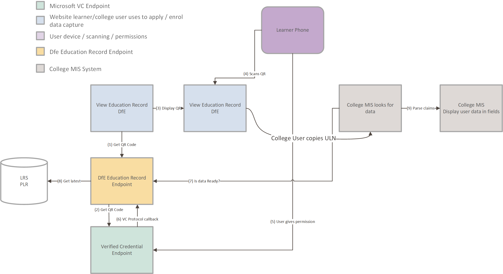

# View Education Record API Integration Example code

The DfE have created a new service to enable learners to share their official education records with Further Education providers. 
To enable learners to share their record with providers, the software systems (Management Information Systems), that the providers use, must integrate with the ‘View Education Record APIs’ (VERA).

This repository includes all the code required to implement a simple Pattern A or Pattern B integration pattern.
It does not contain the required secrets to conect to the DfE test or production systems.

Please reach out to educationrecord.betasupport@education.gov.uk for full test instructions, testflight access, and client credentials.

There are two integration patterns currently on offer. These are known as Pattern A and Pattern B and both are detailed below. 
Pattern A is slightly more technical work but should offer a much improved user experience for the user. 
Pattern B is offered in realisation that different MI vendors will work at different delivery speeds and their customers will require a mechanism to view this data if they cannot achieve that natively in their chosen MIS product.
These APIs are detailed in the following swagger link. https://api.sandbox.view-education-record.education.gov.uk/swagger/index.html 

We would invite MIS developers into our testflight versions of the app - we have slightly more features which are in active development.

## Pattern A
In this pattern the MIS calls VERA method “generate-qr-code”, this will reply with data that can be used to display a QR code that the learner can then scan directly from the DfE Education Record app. The learner scans the QR code which causes an authorisation record to be created so that calling a second method “learner-data” will return an up to date learner education record. The data specification and example JSON block is shown on the end of this document.
These two methods are secured and require a bearer token to authorise access. Each provider will be issued with a unique client id and client secret. The MI vendors will have to be able to setup these values in an appropriate settings database and use the values associated with the logged in user. Each client id is associated with a specific UKPRN. The learner will know which provider organisation is requesting the data and will see the name clearly displayed in the App.
The learner scanning the code sets up a relationship between the learner’s ULN and the users UKPRN – the learner is specifically authorising that provider to access their record. This pattern overcomes some of the issues that can be associated with the existing LRS ability to share flag (AKA privacy seen flag).

### Pattern A - Sequence
The college MIS system will have, in the context of a learner data entry screen:
1)	Generate QR Code button.
2)	This button will call into a new API – generate-qr-code. Secured by bearer token. The bearer token lets the DfE know the provider
3)	DFE payload reply with a QR Code + correlationid
4)	MIS System displays the QR Code
5)	Learner themselves scans the QR code and DfE gets a callback. DfE decode the claims, enhance with latest LRS data, DfE now have the data ready for presentation.
6)	MIS then calls ‘learner-data’ Parameters CorrelationId and secured by the same bearer token
7)	DfE return payload for learner. Or various error codes (see the swagger).

## Pattern B
The user will have two systems open on their laptop.
View Education Record and their MIS system.
In this pattern the user will be logged into a DfE service ‘View Education Record (VER)’. This gives us the UKPRN of the user. The VER service will allow the user to generate a QR code that the learner can scan. If the learner scans and authorises sharing, in the DfE Education Record app, then a link between the learner’s ULN and the users UKPRN will be set up.
Your MIS system can then be enhanced to retrieve that data via a new method ‘learner-data’ with a parameter of the ULN and secured by a JWT bearer token.

### Pattern B - Sequence
View Education record service requires them to login (so we know their UKPRN).
1)	Generate QR Code button
2)	Generates the data and displays on screen. Including the ULN with an ‘easy copy’ option.
3)	Because user signed in we can create a record that allows a combination of UKPRN + ULN to successfully return data. 

The college MIS system will have, in the context of a learner data entry screen:
1)	The ability to paste the ULN
2)	Get “learner data” button.
3)	This button will call into a new API method – learner-data with parameter of ULN and secured with a JWT
4)	DfE returns the payload for learner. Or various error codes (see the swagger).

# Testing Integration
To test integration you will need to be able to issue test education credentials to yourself, load them onto a smart phone (android or iOS) so that you can scan the presentation QR code.
Use the ‘Issue Education Record’ website to do this. Please contact the DfE for appropriate credentials. https://sandbox.issue-education-record.education.gov.uk 

# Code
The repo contains a simple MVC application that implements pattern A and pattern B.
Pattern A calls the DfE with a client secret, gets a JWT bearer token and then calls the generate QR code method.
The QrCode page then displays the QR code that may be scanned with the Education Record app. 
Pattern B requires you to use the View Education Record service in combination with the learner-data API.

